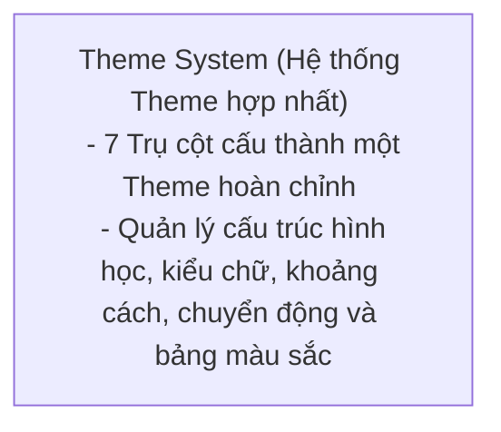

# ⚙️ Quy chuẩn Hệ thống Theme & Design Tokens (W3C Standard)

Tài liệu này định nghĩa hệ thống kiến trúc Theme tổng quát của dự án, tuân thủ các quy tắc tách biệt vai trò (Separation of Concerns) giữa cấu trúc hình học linh kiện (Theme) và màu sắc (Color Palette) theo chuẩn thiết kế hiện đại.

---

### ⚙️ Quy chuẩn Phân cấp Thiết kế: Theme vs. Color Palette vs. Accent Color

Để tránh lẫn lộn giữa cấu trúc hình học của linh kiện (Atoms) và hệ màu sắc, dự án định nghĩa rõ ràng 3 phân cấp thiết kế độc lập sau:



#### 1. Theme (Chủ đề - Bộ khung phong cách, Hình học, Visual Assets & Color Palettes)
*   **Bản chất:** Xác định toàn bộ cấu trúc hình học, phân cấp văn bản, tỷ lệ khoảng cách, hiệu ứng chuyển động, chiều sâu không gian, bộ tài nguyên hình ảnh/icon, và hệ màu sắc của toàn bộ các phần tử cơ bản (Atoms).
*   **7 Trụ cột cấu thành một Theme đầy đủ:**
    1.  **Thông số hình học & Đường viền (Geometry & Borders):** Độ bo góc (`RADIUS`), độ dày viền (`BORDER_WIDTH`), kiểu dáng đường viền (solid, dashed).
    2.  **Hệ thống kiểu chữ (Typography System):** Họ phông chữ (`FONT_FAMILY`), phân cấp kích thước chữ (Font Sizes - H1, H2, body, caption), độ đậm nhạt (Font Weights), và khoảng cách dòng (Line Heights).
    3.  **Hệ thống khoảng cách & Lưới (Spacing System):** Định nghĩa tỷ lệ khoảng đệm trong (`padding`) và lề ngoài (`margin`) theo chuẩn lưới hệ thống (ví dụ: chuẩn lưới 4px hoặc 8px).
    4.  **Độ nổi & Đổ bóng (Shadows & Elevation):** Độ mờ bóng (box-shadows) và chiều sâu 3D (Z-Index / Elevation) để phân biệt các lớp giao diện xếp đè lên nhau.
    5.  **Tương tác & Chuyển động (Motion & Animations):** Thời lượng chuyển cảnh (Duration - e.g. 200ms), đường cong gia tốc chuyển động (Easing - e.g. ease-in-out).
    6.  **Tài nguyên hình ảnh & Icon (Visual Assets):** Icon SVG, logo, tranh minh họa (illustrations) đặc thù của từng chủ đề.
    7.  **Hệ màu sắc & Bảng màu (Color Palettes):** Định nghĩa các sắc độ màu nền (`DARK_BG`, `CARD_BG`), màu văn bản (`TEXT_COLOR`, `SUBTEXT_COLOR`), màu đường viền (`BORDER_COLOR`), và màu sắc thương hiệu (`ACCENT_COLOR`, `ACCENT_HOVER`) cho cả hai môi trường sáng và tối.
*   **Cơ cơ chế dự phòng tài nguyên (Fallback Mechanism):**
    *   Đối với các theme cơ bản nhất, thư mục tài nguyên hình ảnh/icon của theme sẽ **để rỗng mặc định**.
    *   Khi ứng dụng yêu cầu tải một asset (ví dụ: `icon_settings.svg`), hệ thống tải động (`AssetsLoader` hoặc tương đương) sẽ tìm trong thư mục assets của theme hiện tại trước. Nếu không tìm thấy, hệ thống sẽ tự động **fallback (dự phòng) về thư mục tài nguyên mặc định (`default_assets/`)**.
*   **Cách thay đổi:** Được định nghĩa ở bộ khung QSS/CSS gốc (`base.qss` cho Desktop, `index.css` cho Web) và thư mục `assets/` hoặc các tệp JSON phân tầng tương ứng.

---

### 🌐 Kiến trúc Theme Tổng quát & Tiêu chuẩn W3C Design Tokens

Để đạt được sự tổng quát hóa cao nhất ở quy mô công nghiệp (theo chuẩn **W3C Design Tokens Community Group - DTCG**), một hệ thống Theme hoàn chỉnh không chỉ bao gồm các thông số giao diện trực quan (Visual Style) mà phải quản lý được **3 Lớp phân cấp Token** và **3 Trục thích ứng môi trường** sau:

#### 1. Hệ thống Phân cấp Design Tokens (3-Layer Architecture)
*   **Global Tokens (Reference Tokens):**
    *   *Đặc trưng:* Các hằng số thô, độc lập ngữ cảnh (Context-free).
    *   *Ví dụ:* `blue-500: #3b82f6`, `radius-8: 8px`, `font-sans: Inter, sans-serif`.
*   **Alias Tokens (Semantic Tokens):**
    *   *Đặc trưng:* Định nghĩa ý nghĩa thiết kế gắn liền với ngữ cảnh sử dụng (đây chính là lớp quyết định Theme).
    *   *Ví dụ:* `color-bg-primary` trỏ đến `blue-500`, `radius-component` trỏ đến `radius-8`. Khi thay đổi Theme, ta chỉ cần đổi liên kết của Alias Tokens sang các Global Tokens khác.
*   **Component-Specific Tokens:**
    *   *Đặc trưng:* Khóa cấu hình riêng biệt dành riêng cho một linh kiện cụ thể để ghi đè khi cần.
    *   *Ví dụ:* `button-primary-bg` trỏ đến `color-bg-primary`, `input-border-width` trỏ đến `border-width-thin`.

#### 2. Các Trục Thích ứng Ngữ cảnh (Context Adaptability Axes)
Một Theme tổng quát hóa bắt buộc phải thích ứng động theo các chiều không gian vật lý và phần mềm:
*   **Trục Bản địa hóa (i18n & Layout Direction):**
    *   *Chiều rộng chữ:* Phông chữ cho tiếng Latinh (như Inter) có thể rất đẹp nhưng khi hiển thị tiếng Trung/Nhật/Hàn (CJK) sẽ bị lỗi hiển thị. Theme phải định nghĩa phông chữ dự phòng (Fallback Font Stack) tương ứng.
    *   *Hướng bố cục:* Hỗ trợ đổi hướng giao diện từ trái-qua-phải (LTR) sang phải-qua-trái (RTL) cho các ngôn ngữ như tiếng Ả Rập, tự động đảo ngược các thuộc tính `padding-left`/`padding-right`, chiều xoay icon.
*   **Trục Độ tương phản & Khả năng tiếp cận (Accessibility - A11y):**
    *   *Mật độ tương phản:* Chế độ High Contrast dành cho người khiếm thị (đáp ứng tiêu chuẩn WCAG AAA với tỷ lệ tương phản chữ/nền tối thiểu 7:1).
    *   *Khả năng phóng to:* Tự động tăng kích thước font chữ (Dynamic Text Scaling) và độ dày viền tiêu điểm (Focus Rings) khi bật hỗ trợ tiếp cận trên thiết bị.
*   **Trục Mật độ Thiết bị (Device Density Scale):**
    *   *Mật độ Spacing:* Theme phải tự động co giãn khoảng cách Spacing dựa trên thiết bị:
        *   `Compact (Mật độ dày):` Tiết kiệm diện tích cho ứng dụng di động.
        *   `Comfortable (Thoải mái):` Spacing tiêu chuẩn trên máy tính để bàn (Desktop).
        *   `Coarse/Large (Thưa rộng):` Dành cho màn hình TV, Kiosk tương tác cảm ứng.
*   **Trục Đa phương tiện & Phản hồi vật lý (Multimedia & Haptics):**
    *   Định nghĩa âm thanh hệ thống (âm click, âm báo lỗi) và tần số rung phản hồi xúc giác (Haptic patterns) đặc thù của từng chủ đề trên thiết bị di động.

#### 3. Các Mảnh ghép Nâng cao để Đạt tính Tổng quát Tuyệt đối
Dù đã bao quát nhiều khía cạnh thiết kế, để đạt đến độ hoàn thiện tuyệt đối ở cấp độ kỹ nghệ phần mềm quy mô lớn, một Theme bắt buộc phải chuẩn hóa thêm 3 khái niệm sau:
*   **Cặp Màu Tương phản Tương ứng (Contrast On-Colors):**
    *   *Lý do:* Nếu ta chỉ đổi màu nền (`Primary`/`Accent`/`Background`) mà không định nghĩa màu chữ hiển thị phía trên nó, giao diện sẽ bị vỡ độ tương phản (ví dụ: Chữ màu trắng mặc định nằm trên nút bấm màu vàng chanh thương hiệu sẽ hoàn toàn không thể đọc được).
    *   *Giải pháp:* Mọi token màu nền phải đi kèm một token màu chữ đối ứng để đảm bảo độ tương phản tiếp cận (A11y):
        *   `color-primary` đi kèm `color-on-primary` (chữ trên nền primary).
        *   `color-background` đi kèm `color-on-background`.
        *   `color-surface` đi kèm `color-on-surface`.
*   **Hợp đồng Giao diện Theme (Theme Contract / Schema Specification):**
    *   *Lý do:* Khi lập trình viên hoặc khách hàng tự định nghĩa thêm một theme mới (ví dụ: `cyberpunk`), nếu họ quên khai báo một khóa (ví dụ: thiếu `color-border`), ứng dụng có thể bị crash hoặc lỗi hiển thị tại runtime.
    *   *Giải pháp:* Thiết lập một Giao diện ràng buộc dữ liệu (Theme Interface/Contract) ở tầng Entities. Mọi tệp JSON hoặc Class Theme khi đăng ký vào hệ thống bắt buộc phải được xác thực (validate) chống thiếu khóa dữ liệu trước khi nạp.
*   **Mảng Trạng thái Tương tác của Atoms (Component Interactive States):**
    *   *Lý do:* Một phần tử giao diện không đứng yên mà liên tục biến đổi trạng thái theo hành vi người dùng.
    *   *Giải pháp:* Theme phải định nghĩa đầy đủ token màu sắc/style cho 7 trạng thái tương tác cơ bản của Atoms:
        *   `Default (Trạng thái tĩnh)`
        *   `Hover (Di chuột qua)`
        *   `Active/Pressed (Đang nhấn giữ)`
        *   `Focused (Đang chọn bằng bàn phím/tab - cốt lõi của khả năng tiếp cận)`
        *   `Disabled (Bị vô hiệu hóa)`
        *   `Selected (Đang được chọn)`
        *   `Invalid (Trạng thái lỗi dữ liệu đầu vào)`


### 🚀 Quy trình Triển khai Đa nền tảng (Cross-Platform Implementation Pipeline)

Mặc dù lý thuyết Design Tokens theo chuẩn W3C là tổng quát, nhưng để đảm bảo triển khai **thành công và đồng bộ 100% không phát sinh lỗi đồng bộ thủ công** trên Web, Mobile và Desktop, dự án bắt buộc phải thiết lập một **Đường ống Dịch mã tự động (Token Translation Pipeline)**:

```
                  ┌──────────────────────────────┐
                  │  Single Source of Truth      │
                  │  (Figma Tokens / JSON W3C)   │
                  └──────────────┬───────────────┘
                                 │
                   ┌─────────────▼─────────────┐
                   │ Token Translation Engine  │
                   │ (Amazon Style Dictionary) │
                   └─────────────┬─────────────┘
                                 │
         ┌───────────────────────┼───────────────────────┐
         │                       │                       │
┌────────▼────────┐     ┌────────▼────────┐     ┌────────▼────────┐
│  Web CSS/JS     │     │ Desktop (Qt/QSS)│     │ Mobile (Flutter)│
│ :root {         │     │ theme.json /    │     │ class AppTheme {│
│   --bg: #1e1e2e │     │ stylesheet.qss  │     │   static const  │
└─────────────────┘     └─────────────────┘     └─────────────────┘
```

#### 1. Nguyên tắc cốt lõi: Không dịch tay (No Manual Duplication)
Lập trình viên tuyệt đối không được tự ý gõ tay các biến màu hoặc Spacing vào từng nền tảng. Khi có bất kỳ sự thay đổi nào về Brand hoặc Theme, chỉ thay đổi tại tệp JSON gốc và chạy lệnh build để tự động biên dịch ra các định dạng đích:
*   **Web (HTML/React/Vue):** Biên dịch tệp JSON gốc thành **CSS Custom Properties (CSS Variables)** đặt trong `:root` (hoặc định dạng Tailwind Config).
*   **Desktop (PyQt6/C++):** Biên dịch thành tệp **Qt Style Sheet (`.qss`)** và tệp **`theme.json`** cục bộ để nạp động qua `ThemeManager`.
*   **Mobile (Flutter/Compose/SwiftUI):** Biên dịch thành các lớp hằng số **Dart/Kotlin/Swift** tĩnh để tận dụng tính năng kiểm soát kiểu dữ liệu nghiêm ngặt (Type Safety) lúc compile.

#### 2. Bản đồ ánh xạ kỹ thuật trên các nền tảng chính:

| Trụ cột thiết kế | Web Frontend (CSS) | Desktop (PyQt6 QSS) | Mobile (Flutter Dart) | Mobile (Compose Kotlin) |
| :--- | :--- | :--- | :--- | :--- |
| **Geometry & Borders** | `border-radius: var(--radius)` | `border-radius: {RADIUS}` | `BorderRadius.circular(radius)` | `RoundedCornerShape(radius.dp)` |
| **Typography** | `font-family: var(--font-sans)` | `font-family: {FONT_FAMILY}` | `TextStyle(fontFamily: ...)` | `Typography(bodyLarge = ...)` |
| **Spacing** | `padding: var(--spacing-md)` | `layout.setSpacing(SPACING_MD)` | `EdgeInsets.all(spacingMd)` | `Modifier.padding(spacingMd.dp)` |
| **Shadows & Depth** | `box-shadow: var(--shadow-lg)` | `QGraphicsDropShadowEffect` | `BoxShadow(color, blurRadius)` | `Modifier.shadow(elevation.dp)` |
| **Motion** | `transition: all var(--dur-md)` | `QPropertyAnimation(duration)` | `AnimationController(duration)`| `animate*AsState(animationSpec)`|
| **Visual Assets** | `` | `QIcon("path/to/svg")` | `SvgPicture.asset('path')` | `painterResource(id = ...)` |

Áp dụng đúng đường ống tự động này, mọi sự thay đổi về giao diện (như thay đổi từ góc bo tròn sang góc phẳng hoặc đổi màu chủ đạo) sẽ được cập nhật đồng loạt tới Web, Mobile, Desktop chỉ sau một dòng lệnh build duy nhất, triệt tiêu hoàn toàn rủi ro lệch pha hiển thị giữa các nền tảng.


### 🛡️ 3 Rào chắn Kiểm soát Chi tiết giao diện (Guardrails for Absolute UI Control)

Để đảm bảo thiết kế trên Figma được phản ánh chính xác đến từng điểm ảnh (pixel-perfect) trên sản phẩm thực tế, đội ngũ phát triển bắt buộc phải dựng thêm **3 rào chắn kỹ thuật** sau trong vòng đời phát triển phần mềm (SDLC):

#### 1. Rào chắn 01: Ràng buộc Token cấp Linh kiện (Component-Specific Token Constraint)
*   **Nguyên tắc:** Lập trình viên **không được phép** ánh xạ trực tiếp các Global Tokens (ví dụ: `blue-500`) hoặc Semantic Tokens (ví dụ: `color-primary`) vào bên trong thuộc tính style của linh kiện. Bắt buộc phải sử dụng Component-Specific Tokens (ví dụ: `input-border-focus-color`).
*   **Lợi ích:** Cho phép tùy chỉnh chi tiết một thuộc tính giao diện nhỏ (như độ dày viền của ô nhập liệu khi hover) mà **không làm ảnh hưởng hoặc vỡ giao diện** của các nút bấm hay các thẻ card khác sử dụng chung hệ màu chính.

#### 2. Rào chắn 02: Bộ quét tĩnh ngăn chặn Hardcode (Hardcode Prevention Linter)
*   **Nguyên tắc:** Tích hợp công cụ phân tích tĩnh (Linter) vào Git Hook (trước khi commit) hoặc CI/CD pipeline để quét mã nguồn QSS/CSS/Dart/Kotlin:
    *   **Phát hiện và báo lỗi lập tức** nếu lập trình viên sử dụng mã màu thô (như `#ffffff`, `rgba(...)`) hoặc kích thước thô (như `15px`, `24px` mà không qua token `spacing-lg` hay `radius-md`).
*   **Lợi ích:** Triệt tiêu hoàn toàn các đoạn code "rác" phá vỡ hệ thống Design System do lập trình viên viết vội khi làm tính năng.

#### 3. Rào chắn 03: Kiểm thử So khớp Điểm ảnh tự động (Automated Visual Regression Testing)
*   **Nguyên tắc:** Tận dụng tối đa tính chất **Stateless / Pure UI** của các Atoms (Level 1) và Molecules (Level 2) trong mô hình Atomic Design:
    *   Viết test tự động render các component này một cách độc lập trong môi trường cô lập ở mọi trạng thái (Default, Hover, Focus, Pressed, Disabled).
    *   Công cụ kiểm thử sẽ chụp ảnh màn hình (Snapshot) và **so sánh từng điểm ảnh (pixel-by-pixel)** với ảnh mẫu đã phê duyệt. Nếu có sự lệch pha dù chỉ 1 pixel (lệch vị trí text, sai bóng đổ), pipeline sẽ tự động từ chối gộp mã nguồn (Pull Request).
*   **Lợi ích:** Đảm bảo chắc chắn giao diện không bao giờ bị biến dạng hay vỡ layout khi thực hiện refactor mã nguồn hệ thống ở quy mô lớn.

---

### 🛠️ Triển khai Thực tế trong Project Manager App (Concrete Scaffolder Implementation)

Dự án đã hiện thực hóa toàn bộ các lý thuyết trên vào bộ công cụ quản lý dự án (Project Manager CLI) thông qua mẫu thiết kế **GoF Strategy Pattern** và cơ chế biên dịch Design Tokens nạp kép:

#### 1. Cấu trúc Tệp tin Cấu hình (appdata/)
Tất cả các tệp tin cấu hình được lưu trữ tập trung tại [appdata/](file:///d:/DEV/python/templates/python-clean-architecture-kit/scripts/util_dev/project_manager_app/appdata):
*   **Geometric Themes (Chỉ chứa thông số hình học & font chữ):** Đặt tại [appdata/themes/](file:///d:/DEV/python/templates/python-clean-architecture-kit/scripts/util_dev/project_manager_app/appdata/themes/) gồm các tệp tin:
    *   `default_theme.json` (Theme tiêu chuẩn, `RADIUS = 8px`)
    *   `modern_round.json` (Theme bo góc hiện đại, `RADIUS = 12px`)
    *   `flat_retro.json` (Theme phong cách cổ điển phẳng, `RADIUS = 0px`)
*   **Color Palettes (Chỉ chứa mã màu sắc):** Đặt tại [appdata/color_palettes/](file:///d:/DEV/python/templates/python-clean-architecture-kit/scripts/util_dev/project_manager_app/appdata/color_palettes/) (ví dụ: `Dracula.json`, `Catppuccin_Mocha.json`, `Office_Navy.json`...) được làm sạch hoàn toàn khỏi các thuộc tính hình học.

#### 2. Cơ chế Placeholders & Tự động Nội suy Màu sắc
Các tệp tin mẫu (Templates & Factories) sử dụng các placeholder chuẩn để nhận giá trị gộp động từ `ThemeContext`:
*   **Placeholders cơ bản:** `{{ DARK_BG }}`, `{{ RADIUS }}` (hoặc `{ DARK_BG }` dưới dạng f-string).
*   **Nội suy màu sắc cho Kivy (Float Tuple):** Sử dụng hậu tố `_KIVY_FLOAT` (ví dụ: `{{ ACCENT_COLOR_KIVY_FLOAT }}`). `ThemeContext` tự động dịch màu HEX sang tuple float `(r, g, b, 1.0)` với độ chính xác 2 chữ số thập phân phù hợp với canvas của Kivy.
*   **Nội suy màu sắc cho Flutter/Compose (ARGB Hex):** Sử dụng hậu tố `_ARGB` (ví dụ: `{{ DARK_BG_ARGB }}`). Hệ thống tự động dịch sang dạng hex `0xFFxxxxxx`.

#### 3. Bộ biên dịch Strategy & Context (Layer 01)
*   **ThemeContext (GoF Role: Context):** Điều phối toàn bộ vòng đời nạp kép, gộp động cấu hình hình học + màu sắc, nội suy định dạng và quét danh sách các chiến lược đa hình.
*   **Polymorphic Dispatching:** Các Strategy (như `KivyCompilationStrategy`, `WebFastApiStrategy`) tự đăng ký thông qua `@register_strategy` và định nghĩa quy tắc so khớp đường dẫn bằng `is_matching(self, file_path: str) -> bool`. Khi biên dịch, Context tự động định tuyến tệp tin đến Strategy phù hợp mà không sử dụng các rẽ nhánh tĩnh (`if/elif`).

#### 4. Sử dụng CLI hỗ trợ Mix-and-Match
Người dùng có thể tùy ý cấu hình phối hợp một layout hình học và một bảng màu sắc bất kỳ khi sinh một ứng dụng/tính năng mới:
```bash
python main.py --generate-feature <feature_name> --theme <theme_name> --theme-preset <palette_name>
```
*   `--theme`: Tên theme hình học tại `appdata/themes/` (mặc định: `default_theme`).
*   `--theme-preset` (hoặc `--color-palette`): Tên hệ màu tại `appdata/color_palettes/` (mặc định: `Catppuccin_Mocha`).


